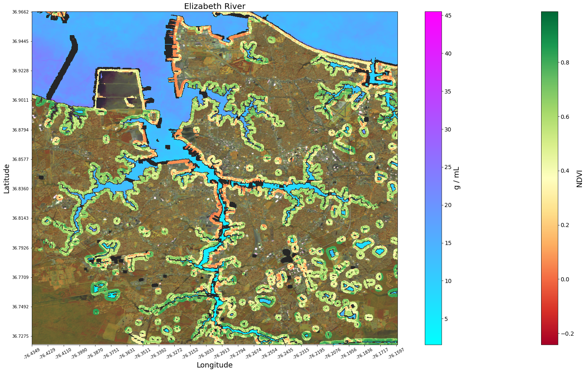
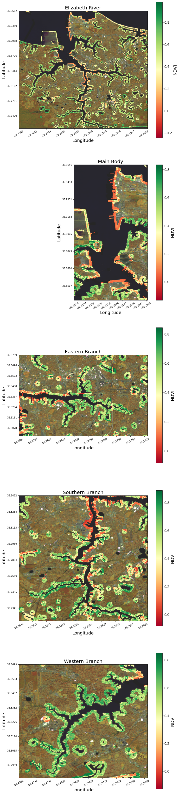

# Chesapeake Bay Riparian Buffer Notebook
---
The goal of this notebook is to explore novel methods for remotely evaluating riparian buffer zones and assessing their ecological effects on water quality.

This notebook was developed as an example for the [Viginia Open Data Cube](https://datacube.online)

